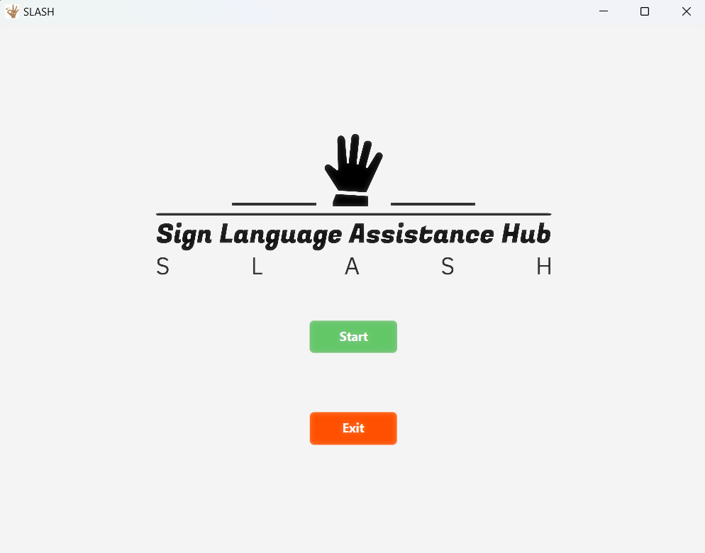
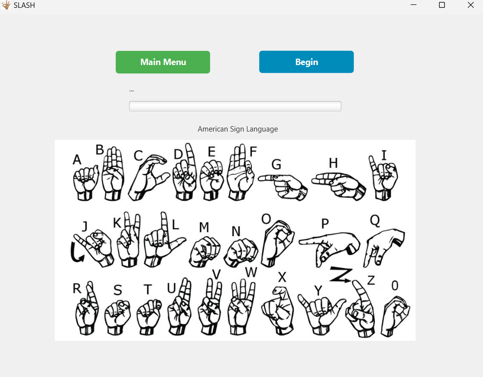
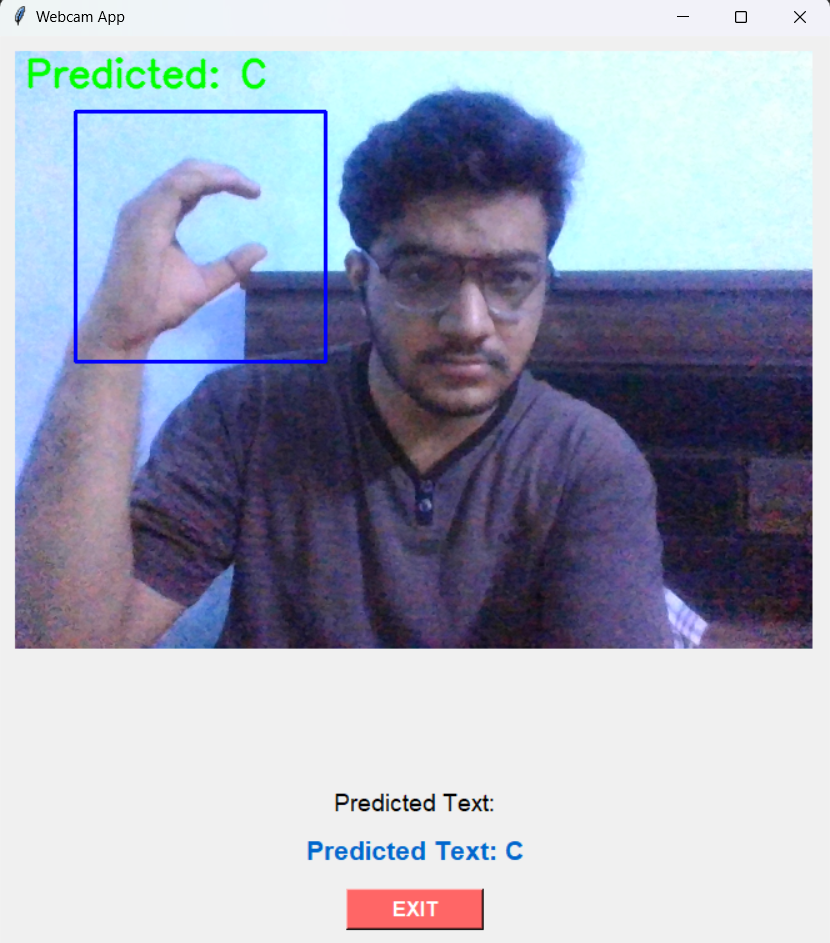

## About
SLASH is a real-time system designed for sign language gesture recognition. The application, developed using Java and Python, serves as a robust platform for creating an intuitive APP. SLASH is capable of predicting 26 classes, corresponding to the letters A through Z.

This project represents  a third-semester university endeavor, showcasing the integration of Java and Python technologies to achieve real-time sign language recognition.

Explore SLASH 

## Table of Contents
- [JavaFX](#JavaFX)
- [Sign Predictor](#python-backend-for-hand-sign-prediction)
- [Requirements](#requirements)
# JavaFX 

Utilizing JavaFX and Scene Builder, this project aims to create an intuitive and responsive Graphical User Interface (GUI) for a Sign Language Assistant. The application consists of two main pages:

## Main Page

The Main Page features essential navigation buttons:
- **Start**: Navigate to the second page.
- **Exit**: Quit the application.

  

## Second Page

The Second Page provides two significant functionalities:
- **Main Page Button**: Return to the main page.
- **Begin Button**: Activate the Python script, initiating the Sign Language model.

  

# Hand Sign Prediction Python Backend
This initiates the Python graphical user interface (GUI) to start predicting hand signs.

  

# Requirements

To run this project, you need the following dependencies:

**For Java:**
- [JavaFX](https://openjfx.io/)
- [Scene Builder](https://gluonhq.com/products/scene-builder/)

**For Python:**
- [OpenCV](https://pypi.org/project/opencv-python/)
- [TensorFlow](https://www.tensorflow.org/install)
- Tkinter (usually included with Python installations)

